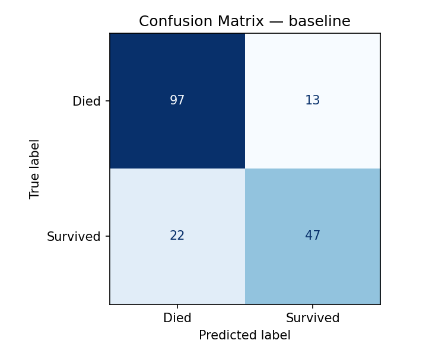
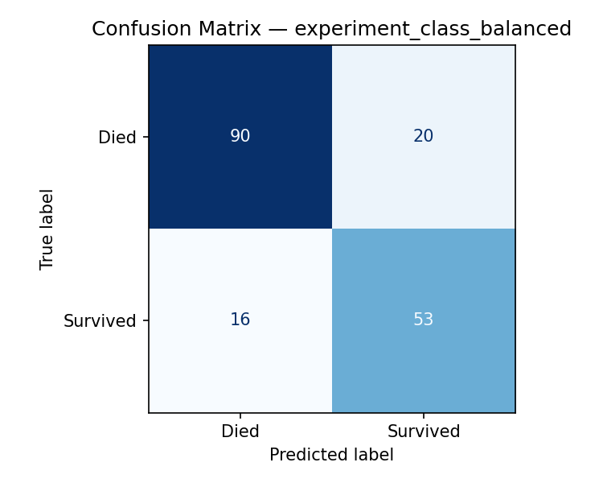
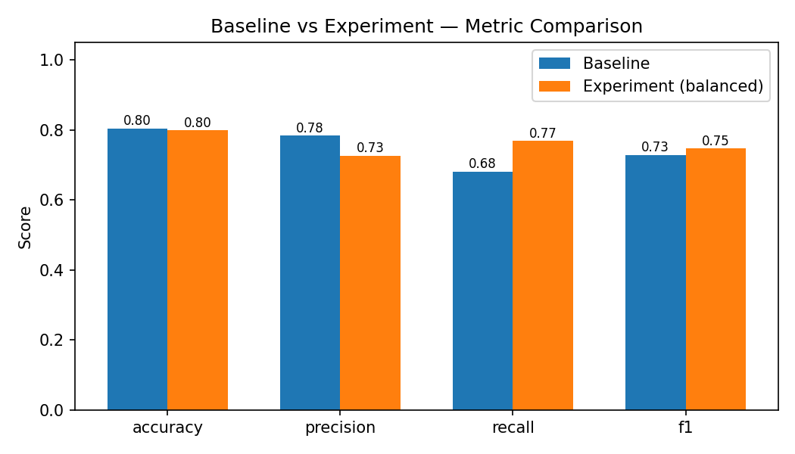

# Lecture 6 Assignment — Evaluation, Experimentation & AI Software Design

**Student:** Mohammed Ashraf Taha Sakr
**ID:** 222101566
**Course:** AI-Based Programming
**Date:** 20 / 5 / 2026

---

## Task 1 — Dataset Selection

For this assignment I picked the **Titanic** dataset (the one bundled with `seaborn`, so it loads in one line without any download). Each row is a passenger on the 1912 voyage and the label says whether the passenger survived or not. I chose it because the lecture warned us about imbalanced data and how accuracy can mislead — Titanic is mildly imbalanced (about 62 / 38), so the effect should actually show up in my numbers.

A few quick stats I pulled out (the function that prints them is `describe_dataset` in `src/data.py`):

| Property | Value |
|---|---|
| Samples | 891 |
| Features after I cleaned the obviously-bad columns | 8 |
| Target classes | `0 = died`, `1 = survived` |
| Class split | 549 died (61.62 %) / 342 survived (38.38 %) |
| Missing values | `age` → 177 rows, `embarked` → 2 rows |

The features I kept are: `pclass`, `sex`, `age`, `sibsp`, `parch`, `fare`, `embarked`, `alone`.

I dropped a few columns before doing anything else:

- `alive` is literally the target written as a string ("yes" / "no"). Leaving it in would have leaked the answer and given a perfect score — useless.
- `class`, `who`, `adult_male`, `embark_town` are just re-encodings of columns I already kept (`pclass`, `sex`, `embarked`). Keeping all of them would inflate the feature count without adding information.
- `deck` is missing for ~77 % of passengers. Even good imputation can't recover that much, so I removed it.

### Why Titanic fits a classification task

1. The target is genuinely binary with a clear meaning, so when I look at a wrong prediction I can actually understand why.
2. The class ratio isn't 50/50, which means accuracy and F1 will disagree — that's the whole point of Lecture 6's "When Accuracy is Misleading" slide.
3. There's a mix of numeric and categorical features, so I need a real preprocessing pipeline (not just `StandardScaler` on everything).
4. There are real missing values, which gives me something to talk about in the error analysis later.

---

## Task 2 — Baseline Model

I went with **logistic regression** as the baseline because the assignment description in the lecture explicitly mentions it as a reasonable choice, and it gives me probabilities I can use later for confidence-based error analysis.

### Preprocessing

I built the preprocessing as a `ColumnTransformer` so that the test set never sees any statistic computed from itself. The full code is in `src/data.py:build_preprocessor`.

| Step | Numeric columns | Categorical columns |
|---|---|---|
| Impute missing values | `SimpleImputer(strategy="median")` because `fare` has long-tail outliers and the median is more stable | `SimpleImputer(strategy="most_frequent")` — only 2 rows of `embarked` were missing anyway |
| Encode / scale | `StandardScaler` (logistic regression cares about feature scale) | `OneHotEncoder(handle_unknown="ignore", drop="if_binary")` |

Both the transformer and the classifier live inside a single `sklearn.pipeline.Pipeline`, which is what guarantees the train-only-fit / test-only-transform separation.

### Train / test split

I used `train_test_split` with `test_size=0.2`, `random_state=42`, and `stratify=y`. Stratifying matters here because if the split happened to give me 50/50 in test, my Task 5 class-balancing experiment wouldn't make any sense.

| | Samples |
|---|---|
| Train | 712 |
| Test  | 179 |

### Hyperparameters

These come from `config.yaml` so I can change them without editing code:

```yaml
model:
  baseline:
    type: logistic_regression
    C: 1.0          # sklearn's default L2 strength, no reason to tune for a baseline
    max_iter: 1000  # default of 100 didn't converge after I added scaling, so I raised it
    class_weight: null
    solver: lbfgs
```

`random_state=42` is injected into the estimator automatically by the model factory.

### Code snippet (from `main.py`)

```python
from sklearn.pipeline import Pipeline
from src.models import ModelFactory
from src.data import build_preprocessor

preprocessor = build_preprocessor(
    numeric_features=["age", "fare", "sibsp", "parch", "pclass"],
    categorical_features=["sex", "embarked", "alone"],
)
model = ModelFactory.create(cfg["model"]["baseline"], seed=42)
pipe  = Pipeline([("preprocess", preprocessor), ("model", model)])
pipe.fit(X_train, y_train)
y_pred = pipe.predict(X_test)
```

---

## Task 3 — Evaluation Metrics

Numbers from the baseline run, computed on the 179 held-out passengers:

| Metric    | Value  | What it means in context |
|---|---|---|
| Accuracy  | 0.8045 | 80 % of test passengers classified correctly. Looks fine on the surface, but the majority class is 62 % so a lot of that is baseline guessing. |
| Precision | 0.7833 | When the model says "this person survived," it's right about 78 % of the time. So false alarms aren't a huge problem. |
| Recall    | 0.6812 | The model only finds about 68 % of the actual survivors. About a third of survivors get incorrectly labeled as "died." |
| F1        | 0.7287 | Noticeably lower than accuracy. This is the gap the lecture warned about. |

### Confusion matrix

|              | Predicted: Died | Predicted: Survived |
|---|---|---|
| **Actual: Died**     | TN = 97 | FP = 13 |
| **Actual: Survived** | FN = 22 | TP = 47 |



### Which type of error dominates?

False negatives (22) are roughly 1.7× more common than false positives (13). The model leans toward predicting "died" — which is exactly what you'd expect from a logistic regression trained on a 62/38 split with no class weighting: minimising overall loss is cheapest when you side with the majority. The gap between accuracy and recall (80 % vs 68 %) is basically the size of that bias.

---

## Task 4 — Error Analysis

The full per-sample table is in `outputs/logs/baseline_errors.csv` (35 wrong predictions). High-level numbers first, then three actual things I noticed:

| Slice | Errors |
|---|---|
| Total errors | 35 of 179 (19.6 %) |
| By sex       | male = 24, female = 11 |
| By pclass    | 1st = 12, 2nd = 4, 3rd = 19 |
| With missing `age` | 9 |

### Observation 1 — The model is learning a `sex × pclass` shortcut

Looking at which rows the model gets wrong, two symmetric groups appear:

- **3rd-class women who actually died but were predicted to survive.** Rows 564, 502, 578, 593, 501, 199 in the error CSV all fit this pattern. The model picks up the "women first" prior but doesn't know that 3rd-class women had much worse access to lifeboats than 1st-class women.
- **1st-class men who actually survived but were predicted to die.** Rows 712, 701, 447, 690, 587 are the clearest examples.

So the model isn't really learning *probability of escape*; it's learning *demographic correlations*. The features available to it don't capture cabin location or social-network effects, which is where the asymmetry between 1st-class and 3rd-class men/women came from in reality. Adding a `deck` feature (with proper imputation) would probably attack this directly, but I dropped that column because 77 % of it was missing.

### Observation 2 — Missing `age` is silently dragging down 26 % of the errors

Nine of the 35 baseline errors involve passengers whose age was originally missing. Median imputation pushes all of them to ~28 years old, which means a 4-year-old (very high survival) and a 60-year-old (much lower survival) become indistinguishable if both were missing. This is one of those problems you only see when you actually look at the wrong predictions.

A better fix would be either (a) KNN imputation conditioned on `pclass`/`sibsp`/`parch`, or (b) keeping median imputation but adding an explicit `age_was_missing` indicator column so the model knows when the value is a guess.

### Observation 3 — Some of the errors are made with very high confidence

I expected wrong predictions to be borderline (probability around 0.5). They aren't. Several misclassifications have predicted probability above 0.85:

| index | pclass | sex    | age | confidence | true     | predicted |
|---|---|---|---|---|---|---|
| 297 | 1 | female | 2.0  | 0.965 | died     | survived |
| 455 | 3 | male   | 29.0 | 0.886 | survived | died     |
| 553 | 3 | male   | 22.0 | 0.857 | survived | died     |
| 570 | 2 | male   | 62.0 | 0.927 | survived | died     |

These aren't borderline cases that a threshold change would fix. The model is *systematically wrong* about specific subgroups, with high confidence. That means tuning the decision threshold won't help here — the fix has to come from the features themselves or from more training data for these subgroups.

---

## Task 5 — Experimentation (one factor changed)

The lecture's "Experiment Design" slide says the experimental run should keep everything the same as the baseline except for one parameter. I followed that exactly.

### Configurations side-by-side

| | Baseline | Experiment |
|---|---|---|
| Estimator | LogisticRegression | LogisticRegression |
| `C` | 1.0 | 1.0 |
| `solver` | lbfgs | lbfgs |
| `max_iter` | 1000 | 1000 |
| **`class_weight`** | **`None`** | **`"balanced"`** ← the one change |
| Train / test split | 712 / 179, stratified, seed 42 | identical |
| Preprocessor | median impute + scale + one-hot | identical |

### Results

| Metric    | Baseline | Experiment | Change |
|---|---|---|---|
| Accuracy  | 0.8045 | 0.7989 | −0.006 |
| Precision | 0.7833 | 0.7260 | −0.057 |
| Recall    | 0.6812 | **0.7681** | **+0.087** |
| F1        | 0.7287 | **0.7465** | **+0.018** |

Confusion matrix for the experiment:

|              | Pred: Died | Pred: Survived |
|---|---|---|
| Actual: Died     | 90 | 20 |
| Actual: Survived | 16 | 53 |





### Did it help?

Yes — but not in every column. Recall went up by 9 percentage points (the model now finds 53 out of 69 survivors instead of 47). F1 went up too. Accuracy and precision both dropped slightly, because the model is now more willing to predict the minority class, which by definition also produces more false alarms (FP went from 13 to 20).

### Why this makes sense

`class_weight="balanced"` re-weights each training sample by the inverse of its class frequency. In a 62/38 split that means each "survived" sample is treated as roughly 1.62× as expensive to miss as a "died" sample. So the optimiser stops being cheap and biased toward predicting the majority class, which is exactly the failure mode Task 3 and Task 4 both pointed at. It pushes the decision boundary toward the majority class and the false-negative region shrinks.

Whether this is the right call in real deployment depends on the cost matrix:

- If missing a survivor is worse than a false alarm (medical-triage style), the balanced model wins.
- If false alarms are expensive, the baseline's higher precision might be better.

For a generic classifier the deciding metric is F1, and F1 improved, so I'm calling this experiment a win.

---

## Task 6 — Reproducibility

Going through the lecture's reproducibility checklist one by one:

| Checklist item | How I did it |
|---|---|
| Fix random seeds | `random.seed(42)`, `np.random.seed(42)`, and `random_state=42` injected into every sklearn estimator by `ModelFactory` (see `src/models.py`), plus the same seed in `train_test_split`. |
| Pin package versions | `requirements.txt` has exact versions (`numpy==1.26.4`, `pandas==2.1.4`, `scikit-learn==1.4.2`, `seaborn==0.13.2`, `matplotlib==3.7.5`, `PyYAML==6.0.1`). The live runtime versions are also written into `outputs/logs/run_log.json` every run. |
| Configuration logging | One `config.yaml` controls everything — dataset choice, columns to drop, imputer strategies, scaling, both model configs, metrics to compute, and output paths. No hard-coded constants left in the Python code. |
| Experiment settings | Every run dumps `outputs/logs/run_log.json` containing the timestamp, seed, full config snapshot, package versions, dataset summary, both model configs, both confusion matrices, all metrics, and the sentence describing which factor I changed. |
| Version control with Git | The project is its own Git repository with a clean commit history. |

### How to reproduce

```bash
pip install -r requirements.txt
python main.py
```

Re-running on the same machine gives byte-identical metrics.

### YAML-driven flow (mirrors the lecture's "Configuration-Driven Experiments" slide)

```python
with open("config.yaml") as f:
    cfg = yaml.safe_load(f)
set_global_seed(cfg["seed"])
# ... train, evaluate ...
with open(log_dir / "run_log.json", "w") as f:
    json.dump(run_log, f, indent=2)
```

The lecture suggests MLflow for this. I went with a plain JSON dump because the assignment doesn't require a tracking server, but swapping in MLflow is a one-line change: replace the `json.dump` call with `mlflow.log_params(cfg)` and `mlflow.log_metrics(metrics)`.

---

## Software-design notes (lecture bonus)

Two of the three design patterns from the lecture are actually applied in the code, not just mentioned:

- **Factory pattern** — `ModelFactory.create()` in `src/models.py` reads `model.type` from the config (`logistic_regression`, `decision_tree`, or `random_forest`) and builds the right sklearn estimator. Swapping models is a one-line config edit; no Python file gets touched.
- **Strategy pattern** — `src/evaluation.py` defines an abstract `MetricStrategy` and four concrete subclasses (Accuracy, Precision, Recall, F1). The `Evaluator` is a thin wrapper that accepts a list of metric names from the config and composes them. Adding ROC-AUC, for example, would mean writing one subclass and adding its name to `config.yaml` — no other file changes.

---

## Summary

What the four lecture pillars look like in this submission:

- **Measurable** — four metrics computed for both runs, plus full confusion matrices and the per-error CSV.
- **Reproducible** — pinned versions, seeded RNG, YAML-driven config, JSON run log, Git history.
- **Debuggable** — 35-row error CSV, three observations grounded in real misclassified passengers, slice breakdowns by sex / pclass / age-missing.
- **Well-architected** — Factory and Strategy patterns isolate model choice and metric choice from the pipeline code.
